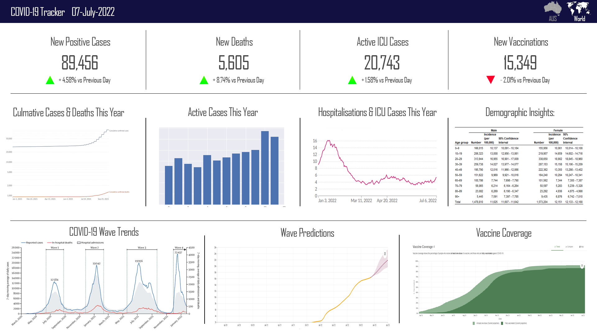

```{r setup, include=FALSE}
knitr::opts_chunk$set(echo = TRUE)
```

# Task 4 - Insights (15 marks)

Imagine you have been asked to plan for a dashboard that shall show the trends and the main figures of the different Covid19 waves that happened world wide in the last pandemic. Given the current data in this assignment is only covering the first wave of the Covid19, how would you augment this data? What are the other sources of data that you will rely on? What types of figures will you be focusing on to show in your dashboard? and why?

**Task 4 Report**:

Write the report as follows:

1. **Objectives**:

The primary objective of this dashboard is to provide a comprehensive view of the Covid-19 pandemic, specifically focusing on the different waves that have occurred worldwide. The dashboard aims to offer insights into the pandemic from an Australian perspective, particularly during the beginning of the third wave. Key objectives include:

- Visualizing and analyzing trends of Covid-19 waves, with a specific focus on the third wave.
- Presenting a comparative analysis of Covid-19 data globally and in Australia.
- Providing real-time information on key Covid-19 statistics, including daily cases, deaths, active cases, hospitalizations, ICU admissions, and vaccinations.
- Predicting future wave trends and the potential impact on Australia.
- Incorporating demographic data for Australia to assess the pandemic's impact on different population groups.

2. **List of data sources to augment the existing data**:

All data from our world in Data is from the 1st of May 2020 till 25th of October 2023.

Vaccinations Data: We will obtain vaccination data from Our World in Data to track the progress of vaccination campaigns in Australia and globally.

Confirmed Cases Per 1M Population: This data will be sourced to assess the infection rate per million people, providing a standardized comparison of Covid-19 prevalence. The specific link will be provided.

Deaths Data: We will access the Our World in Data repository for global and Australian Covid-19 mortality data.

Cases Data: Data on confirmed Covid-19 cases will be obtained from Our World in Data to track the progression of the pandemic.

Tests Data: Covid-19 testing data will be acquired from Our World in Data to monitor the testing coverage and its impact on case detection.

Hospitalizations & ICU Data: Data on Covid-19 hospitalizations and ICU admissions will be sourced from Our World in Data to assess the burden on the healthcare system.

Fatality Rate Data: We will utilize data from Our World in Data to calculate and display fatality rates.

Demographic Data for Australia: Demographic data, health information, and other relevant statistics for Australia will be obtained from the Australian Institute of Health and Welfare to analyze the pandemic's impact on different population segments.This data is over the time period of Jan 2020, till May 20`22.

3. **Set of figures/tables to show in the dashboard**:

The dashboard will feature a set of figures and tables that provide a holistic view of the Covid-19 pandemic, with a focus on the third wave and its impact on Australia. Key visualizations include:

- Daily Cases: A line chart displaying daily new Covid-19 cases in Australia and globally.
- Deaths: A line chart showing daily Covid-19-related deaths in Australia and globally.
- Cumulative Cases and Deaths: Stacked area charts representing the cumulative number of cases and deaths over time.
- Active Cases: A bar chart displaying the number of active Covid-19 cases in Australia.
- Hospitalizations and ICU Admissions: A combined line chart illustrating hospitalizations and ICU admissions in Australia.
- Wave Trends: A line chart displaying the trends of Covid-19 waves worldwide and in Australia.
- Wave Predictions: A predictive model providing forecasts for the progression of the third wave in Australia.
- Vaccination Coverage: A line chart depicting the percentage of the population vaccinated over time.
- Demographic Insights: Demographic data tables and heat maps presenting the impact of Covid-19 on different age groups, regions, and health indicators in Australia.

4. **Analysis strategy**:

To fulfill the objectives of the dashboard, the following analysis strategies will be employed:

Wave Analysis: Identify and classify Covid-19 waves based on historical data and trends, with a focus on the third wave's emergence and trajectory.

Comparative Analysis: Compare Covid-19 statistics between Australia and other countries to assess Australia's position in the global context.

Real-time Tracking: Continuously update the dashboard with the latest data to provide real-time information on Covid-19 trends.

Predictive Modeling: Utilize predictive models to predict the potential impact of the third wave on Australia, providing advanced warning and insights.

Demographic Assessment: Analyze demographic data to understand how different segments of the Australian population are affected by the pandemic.

This dashboard will serve as a valuable tool for policymakers, healthcare professionals, and the general public, offering insights into the Covid-19 pandemic's progression and impact from an Australian perspective. It will enable data-driven decision-making and enhance public awareness during this critical phase of the pandemic.

Below is an example of what this dashboard could potentially look like. *Note the data and graphs presented in the following image are for reference only and do not represent the associated data.




```

**(Optional) Reflection on the whole unit goes here**: 

Positives: I thought the unit was really benefitial to me and I gained a lot of useful experience through the things I learned. The assignment workload was manageable.

Negatives: I felt that some of the tasks in the assignments needed to be more clearly explained, also it would help if maybe the first assignment was a week earlier, just to spread out the assignments and so students can get feedback earlier. Finally, getting feedback earlier, as a student it is hard to grasp my own understanding of a topic or the effort which will be required for an assignment when I have been provided no feedback. 

----

*** 